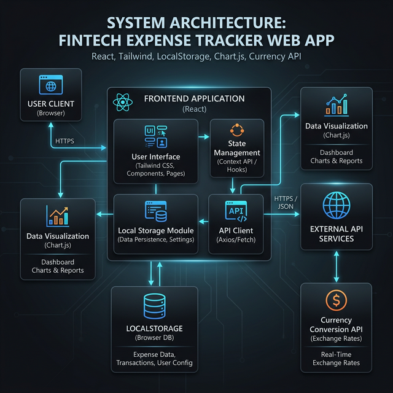
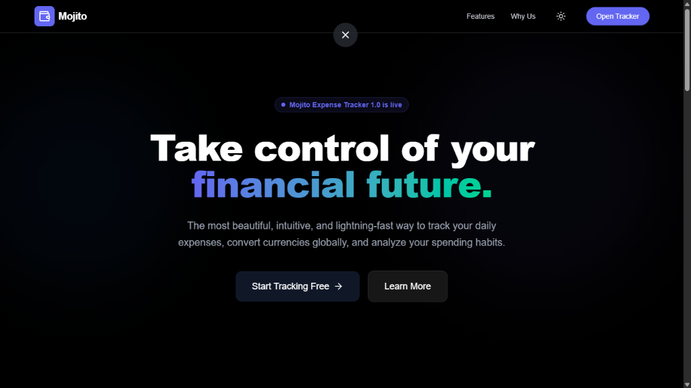
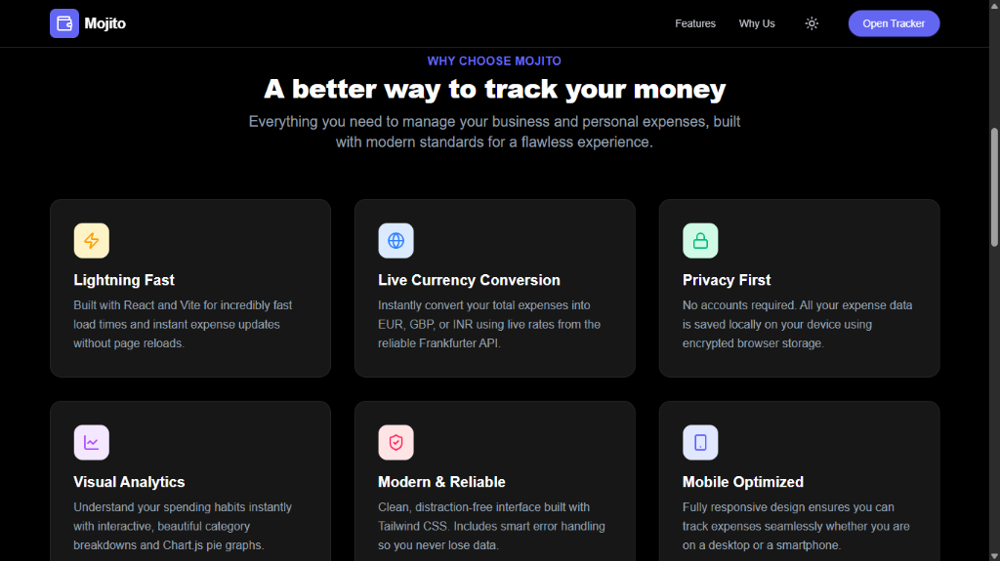
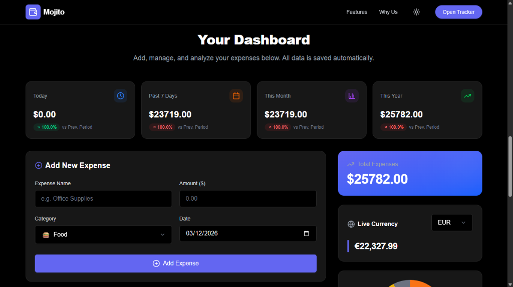
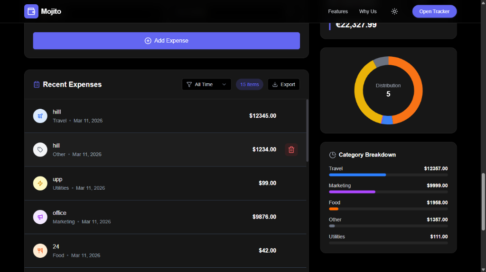

# 🍹 Mojito Expense Tracker

> A premium, dark-themed fintech dashboard built with **React 19**, **Tailwind CSS 4**, and **Chart.js**. Track your expenses, analyze spending habits, and convert currencies with real-time exchange rates.



---

## 📖 Project Overview

**Mojito Expense Tracker** is a modern financial management tool designed for users who value aesthetics and efficiency. Built on a high-performance React foundation with a "Privacy-First" local storage approach, it provides a seamless experience for tracking daily transactions.

**Main Purpose:**  
To bridge the gap between simple scratchpad budgeting and overly complex financial software with a sleek, interactive dashboard.

---

## ✨ Key Features

- **🚀 Instant Tracking:** Add expenses with real-time UI updates and category-based emojis.
- **📊 Interactive Analytics:** Categorized spending charts using **Chart.js** and **react-chartjs-2**.
- **💱 Live Currency Conversion:** Convert expense views into **EUR**, **GBP**, or **INR** via the [Frankfurter API](https://www.frankfurter.app/).
- **🕒 Smart Filtering:** Toggle views for Today, Last 7 Days, Last 30 Days, or Yearly data.
- **🌓 Modern Dark UI:** A premium "Fintech" dashboard with glassmorphism, custom dropdowns, and smooth transitions.
- **💾 Local Persistence:** Automatic data syncing to `localStorage` for offline-ready persistence.
- **⚡ Loading Experience:** Premium "SaaS-style" animated loading screen.
- **🔔 Notifications:** Real-time feedback using **React Hot Toast**.

---

## 🏗 System Architecture

Mojito follows a modular **Component-Based Architecture** where state is managed at the core `Home` page level and propagated through props to specialized dashboard widgets.

### 🖼 System Design Diagram


### Architectural Layers
1.  **UI/Presentation Layer:** Built using React functional components and styled with **Tailwind CSS 4** for high-performance, utility-first UI.
2.  **State Management:** Utilizes React's `useState` and `useEffect` hooks for reactive data flow, synced with `localStorage`.
3.  **Data Processing:** Custom utility logic for aggregating totals, calculating category percentages, and filtering historical data.
4.  **Integration Layer:** Asynchronous service layer for fetching live exchange rates.
5.  **Visualization Layer:** Data-driven implementation for rendering responsive financial graphs.

---

## 🛠 Tech Stack

-   **Framework:** [React 19](https://react.dev/)
-   **Build Tool:** [Vite](https://vitejs.dev/)
-   **Styling:** [Tailwind CSS 4](https://tailwindcss.com/)
-   **Icons:** [Lucide React](https://lucide.dev/)
-   **Charts:** [Chart.js](https://www.chartjs.org/) / [react-chartjs-2](https://react-chartjs-2.js.org/)
-   **Notifications:** [React Hot Toast](https://react-hot-toast.com/)
-   **API:** [Frankfurter API](https://www.frankfurter.app/)

---

## 💾 Data Schema

Currently, Mojito uses a **Document-based Schema** stored as a JSON array in the browser.

### The `expense` Object
| Field | Type | Description |
| :--- | :--- | :--- |
| `id` | `uuid` | Unique identifier (generated via `crypto.randomUUID()`) |
| `name` | `string` | Transaction description |
| `amount` | `number` | Numerical cost in USD (base) |
| `category` | `string` | Tag (Food, Travel, Utilities, Entertainment, etc.) |
| `date` | `string` | ISO formatted date |

---

## 📁 Folder Structure

```text
/mojito-expense-tracker
├── src/
│   ├── components/
│   │   ├── dashboard/       # Core widgets (Charts, Forms, Currency)
│   │   ├── layout/          # Global UI (Navbar, Footer)
│   │   ├── ui/              # Reusable atoms (CustomDropdown, Loader)
│   │   └── landing/         # Landing page sections (Hero, WhyUseUs)
│   ├── pages/
│   │   └── Home.jsx         # Central logic and state hub
│   ├── App.jsx              # Application Root
│   └── main.jsx             # React entry point
├── public/                  # Assets & Architecture diagrams
└── package.json             # Core dependencies
```

---

## 🚀 Installation & Setup

1.  **Clone the Repository:**
    ```bash
    git clone <your-repo-url>
    cd mojito-expense-tracker
    ```
2.  **Install Dependencies:**
    ```bash
    npm install
    ```
3.  **Setup Environment Variables:**
    Create a `.env` file based on `.env.example`:
    ```env
    VITE_FRANKFURTER_API_URL=https://api.frankfurter.app/latest
    ```
4.  **Run Development Server:**
    ```bash
    npm run dev
    ```

---

## 📸 Screenshots

### Landing Page
<p align="center">
  
</p>
<p align="center">
  
</p>

### Dashboard & Analytics
<p align="center">
  
</p>
<p align="center">
  
</p>

---

## 🔮 Roadmap

-   [ ] **User Auth:** Firebase/Supabase integration for cloud sync.
-   [ ] **AI Insights:** Automated spending advice powered by Gemini.
-   [ ] **Export:** Download reports in PDF/CSV format.
-   [ ] **PWA Support:** Installable app for mobile tracking.

---

## 📄 License
This project is licensed under the **MIT License**.

---
*Developed for excellence in personal finance tracking.*
